# MMCAF-Net 架构详细流图 (本科生友好版)

这份文档旨在通过直观的流程图和通俗的解释，帮助您理解 MMCAF-Net 模型的内部工作原理。我们将整个模型拆解为三个主要部分：**特征提取 (Feature Extraction)**、**特征融合 (Feature Fusion)** 和 **分类预测 (Classification)**。

## 1. 整体架构概览

模型同时处理两种数据：**CT 影像 (3D 图像)** 和 **临床表格数据 (数值)**。它们分别经过两条独立的路径提取特征，最终在深层进行融合以做出诊断。

```mermaid
graph TD
    %% =======================
    %% 1. 数据输入层
    %% =======================
    subgraph Input [数据输入]
        IMG_IN[CT 影像 3D<br>Batch, 1, 12, 192, 192]:::img
        TAB_IN[临床表格<br>Batch, 7]:::tab
    end

    %% =======================
    %% 2. 图像编码器 (Image Encoder)
    %% =======================
    subgraph ImgEncoder [图像特征提取 Img_new]
        direction TB
        PENET[PENet Backbone]:::img_proc
        
        %% 多尺度特征提取
        subgraph Pyramid [多尺度特征金字塔]
            S1[Stage 1: 深层<br>1024通道]:::img_proc
            S2[Stage 2: 中层<br>512通道]:::img_proc
            S3[Stage 3: 浅层<br>256通道]:::img_proc
            
            S1_UP[UCB上采样]:::img_proc
            S2_UP[UCB上采样]:::img_proc
            
            S1 --> S1_UP --> S2
            S2 --> S2_UP --> S3
        end
        
        %% BFPU 融合
        subgraph BFPU_Block [BFPU 融合模块]
            BFPU1[BFPU 1]:::img_proc
            BFPU2[BFPU 2]:::img_proc
            
            S2 --> BFPU1
            S3 --> BFPU1
            S1 --> BFPU2
            BFPU1 --> BFPU2
        end
        
        %% 输出头
        POOL[3D全局最大池化]:::img_proc
        FLAT[展平 Flatten]:::img_proc
        FC_IMG[全连接降维<br>1024 to 24]:::img_proc
        
        PENET --> S1
        PENET --> S2
        PENET --> S3
        BFPU2 --> POOL --> FLAT --> FC_IMG
    end

    %% =======================
    %% 3. 表格编码器 (Tab Encoder)
    %% =======================
    subgraph TabEncoder [表格特征提取]
        KAN[KAN Layer<br>非线性映射<br>7 to 24]:::tab_proc
    end

    %% =======================
    %% 4. 多尺度融合 (Fusion)
    %% =======================
    subgraph Fusion [多尺度多模态融合 MultiScale_Fusion]
        direction TB
        NORM[归一化 BatchNorm1d]:::fusion
        
        %% 尺度 1 (24维)
        subgraph Level1 [Level 1 - 24维]
            CA1[交叉注意力<br>Cross Attention]:::attn
            OUT1[Out 1]:::fusion
        end
        
        %% 尺度 2 (12维)
        subgraph Level2 [Level 2 - 12维]
            DS1[下采样 & 残差]:::fusion
            CA2[交叉注意力<br>Cross Attention]:::attn
            OUT2[Out 2]:::fusion
        end
        
        %% 尺度 3 (6维)
        subgraph Level3 [Level 3 - 6维]
            DS2[下采样 & 残差]:::fusion
            CA3[交叉注意力<br>Cross Attention]:::attn
            OUT3[Out 3]:::fusion
        end
        
        %% BSF 融合
        subgraph BSF_Block [BSF 自底向上融合]
            SF1[SF1: 融合 L2 & L3]:::fusion
            SF2[SF2: 融合 L1 & SF1]:::fusion
        end
        
        %% 连接逻辑
        NORM --> CA1 --> OUT1
        NORM --> DS1 --> CA2 --> OUT2
        OUT1 --> DS1
        DS1 --> DS2 --> CA3 --> OUT3
        OUT2 --> DS2
        
        OUT2 --> SF1
        OUT3 --> SF1
        OUT1 --> SF2
        SF1 --> SF2
    end

    %% =======================
    %% 5. 输出层
    %% =======================
    subgraph Output [预测输出]
        CLS[分类器 MLP<br>24 to 1]:::out
        RES((最终预测)):::out
    end

    %% 全局连接
    IMG_IN --> PENET
    TAB_IN --> KAN
    
    FC_IMG --> NORM
    KAN --> NORM
    
    SF2 --> CLS --> RES

    %% 样式
    classDef img fill:#e3f2fd,stroke:#0277bd,stroke-width:2px;
    classDef tab fill:#fff3e0,stroke:#ef6c00,stroke-width:2px;
    classDef img_proc fill:#b3e5fc,stroke:#0288d1,stroke-width:1px;
    classDef tab_proc fill:#ffe0b2,stroke:#f57c00,stroke-width:1px;
    classDef fusion fill:#e8f5e9,stroke:#2e7d32,stroke-width:2px;
    classDef attn fill:#c8e6c9,stroke:#388e3c,stroke-width:1px;
    classDef out fill:#f3e5f5,stroke:#7b1fa2,stroke-width:2px;
```

***

## 2. 详细步骤解析

### 第一阶段：各自为战 (特征提取)

在这个阶段，图像和表格数据互不干扰，各自通过最适合自己的网络提取特征。

#### 1. 图像流 (Image Stream)

* **输入**: 你的 3D CT 肺部扫描切片。

* **PENet (骨干网)**: 就像人的眼睛，它通过多层卷积网络（CNN）提取图像特征。

  * *浅层*：看到边缘、纹理。

  * *深层*：看到形状、结节。

* **多尺度金字塔**: 这是一个巧妙的设计。它不仅看整体（深层特征），还回头看细节（浅层特征），并通过“上采样”把深层的语义信息传给浅层，让每一层都变得更“聪明”。

* **降维打击**: 最终提取出的图像特征非常庞大（1024维），为了能和简单的表格数据对话，模型通过一个全连接层（FC）将其**强制压缩到 24 维**。这就像把一本厚书写成了 24 句话的摘要。

#### 2. 表格流 (Tabular Stream)

* **输入**: 病人的临床指标（如年龄 65、性别男、吸烟是）。

* **KAN (Kolmogorov-Arnold Network)**: 这是该模型的亮点。传统的网络用简单的 $y=wx+b$ 处理数据，而 KAN 使用\*\*可学习的波浪线（样条函数）\*\*来拟合数据。

  * 它能捕捉更复杂的非线性关系（比如年龄和患病率可能不是直线关系，而是某种曲线）。

  * 它将 7 个简单的数字扩展成 **24 维** 的丰富特征向量，使其在信息量上能与压缩后的图像特征“平起平坐”。

***

### 第二阶段：强强联手 (多尺度融合)

现在，图像特征 (Img) 和表格特征 (Tab) 都是 **24 维** 的向量了。模型通过一个叫 `MultiScale_Fusion` 的模块让它们互相“交流”。

1. **交叉注意力 (Cross Attention)**:

   * 图像问表格：“我看到这里有个阴影，你看看病人是不是吸烟？”

   * 表格问图像：“病人年龄很大，你看看肺部纹理是不是更粗糙？”

   * 通过这种机制，两个模态的信息互相加权、补充。

2. **多尺度交互**:

   * 模型不仅仅在 24 维（原始尺度）上交流。

   * 它还把特征降维到 12 维、6 维，在更抽象的层次上再交流两次。

   * 这就像两个人不仅聊具体的细节，还聊宏观的趋势。

3. **BSF (Bottom-Up Fusion)**:

   * 最后，将 6 维、12 维、24 维交流的结果从下往上重新整合起来，形成一个最完美的 **24 维融合特征**。

***

### 第三阶段：一锤定音 (分类预测)

* **输入**: 融合后的 24 维特征。

* **分类器**: 一个简单的全连接层，将 24 个特征综合考虑，输出一个 0 到 1 之间的概率值。

  * `> 0.5`: 预测为阳性（患病）。

  * `< 0.5`: 预测为阴性（健康）。

***

## 3. 关键知识点总结 (考试/答辩用)

1. **模态对齐**: 为什么图像要降维到 24？为了和表格特征在同一个维度空间（Latent Space）里对话。
2. **KAN 的作用**: 替代传统的 MLP，用更少的参数拟合更复杂的临床数据非线性关系。
3. **多尺度融合**: 不只是一次融合，而是像千层饼一样，在不同分辨率（24, 12, 6）上多次融合，确保信息互补最大化。

